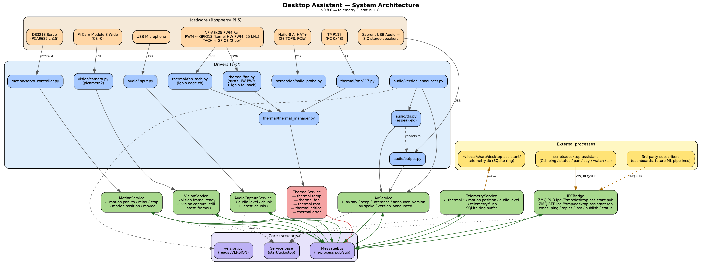

# System Architecture



The authoritative diagram is **architecture.pdf**. The `.png` above is for
GitHub viewing, and `.svg` is for embedding elsewhere. All three are
regenerated from `architecture.dot` by `build.sh`.

## Process model (v0.6.0)

Two systemd units run on the Pi:

| Unit | Purpose | Why isolated |
| --- | --- | --- |
| `desktop-assistant-thermal.service` | `ThermalService` only | Safety-critical: must keep running even if the rest of the stack crashes. `Restart=always`, no rate limit. |
| `desktop-assistant-core.service` | Motion, Vision, AudioCapture, AV, IPCBridge | Cheap to colocate on a single in-process `MessageBus`. `Wants=`/`After=` thermal. |

Each unit owns its own `MessageBus`. Cross-process communication happens
through the `IPCBridge` (ZeroMQ over Unix-domain `ipc://` sockets):

* **PUB** `ipc:///tmp/desktop-assistant.pub` — every bus event, JSON-encoded
* **REP** `ipc:///tmp/desktop-assistant.rep` — `publish` / `last` / `topics` / `ping`

The `scripts/desktop-assistant` CLI is the canonical external client.

## Bus topics

Sources of truth for these are the service modules under `src/services/`.
Keep this list in sync with the diagram.

* `service.started` / `service.stopped` (all services)
* **thermal**: `thermal.temp`, `thermal.fan`, `thermal.rpm`, `thermal.critical`, `thermal.error`
* **motion** (in): `motion.pan_to`, `motion.relax`, `motion.stop`
* **motion** (out): `motion.position`, `motion.moved`
* **vision** (out): `vision.frame_ready`, `vision.error`, `vision.still_saved`
* **vision** (in): `vision.capture_still`
* **audio**: `audio.level`, `audio.chunk`, `audio.error`
* **av** (in): `av.say`, `av.beep`, `av.utterance`, `av.announce_version`
* **av** (out): `av.spoke`, `av.version_announced`
* **telemetry**: `telemetry.flush` (out)

## Regenerating the diagram

```bash
bash docs/architecture/build.sh
```

Requires `graphviz` (`sudo apt-get install -y graphviz`).

## When to update

See agent imperative #7 in `.github/copilot-instructions.md`. In short:
**any** of the following requires editing `architecture.dot`, regenerating
the PDF/SVG/PNG, and committing them in the same change:

1. New, removed, or renamed service
2. New, removed, or renamed bus topic with a cross-service consumer
3. New, removed, or replaced hardware component
4. New, removed, or renamed systemd unit
5. New external interface (CLI, HTTP, MQTT, additional ZMQ socket, …)
6. Change in process boundaries (e.g., splitting a unit)
